# Procesverslag
Markdown is een simpele manier om HTML te schrijven.  
Markdown cheat cheet: [Hulp bij het schrijven van Markdown](https://github.com/adam-p/markdown-here/wiki/Markdown-Cheatsheet).

Nb. De standaardstructuur en de spartaanse opmaak van de README.md zijn helemaal prima. Het gaat om de inhoud van je procesverslag. Besteedt de tijd voor pracht en praal aan je website.

Nb. Door *open* toe te voegen aan een *details* element kun je deze standaard open zetten. Fijn om dat steeds voor de relevante stuk(ken) te doen.

## Jij

  
uitwerken voor kick-off werkgroep

  ### Auteur:
  David Jenniskens

  #### Je startniveau:
  Blauw

  #### Je focus:
  Responsiveness
 

## Je website

  
uitwerken voor kick-off werkgroep

  ### Je opdracht:
  Bunq 
  https://www.bunq.com/en-nl/

  #### Screenshot(s) van de eerste pagina (small screen): 
  hier de naam van de pagina  
  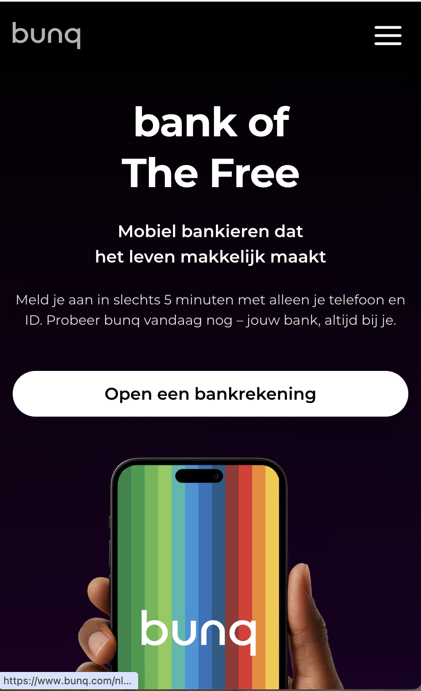

  #### Screenshot(s) van de tweede pagina (small screen):
  hier de naam van de pagina  
  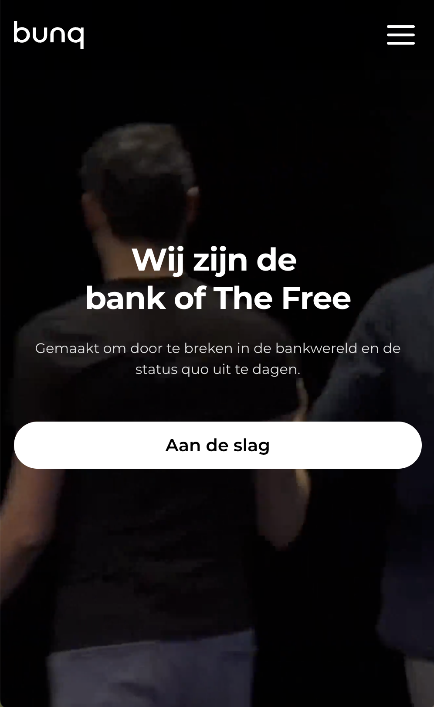

 

## Toegankelijkheidstest 1/2 (week 1)

  
uitwerken na test in 2e werkgroep

  ### Bevindingen
  Lijst met je bevindingen die in de test naar voren kwamen:
  <ul>
  <li>Slaat de inlogbutton over in de navigatiebalk in Safari als ik met TAB navigeer door de pagina.</li>
  <li>Gaat alleen naar alle buttons, niet semantisch dus.</li>
  </ul>

## Breakdownschets (week 1)

  
uitwerken na afloop 3e werkgroep

  ### de hele pagina: 
  
  
  

  ### dynamisch deel (bijv menu): 
  

## Voortgang 1 (week 2)

  
uitwerken voor 1e voortgang

  ### Stand van zaken
  hier dit ging goed & dit was lastig (neem ook screenshots op van delen van je website en code)

  ### Agenda voor meeting
  samen met je groepje opstellen

  | student 1      | student 2          | student 3    | student 4        |
  | ---            | ---                | ---          | ---              |
  | dit bespreken  | en dit             | en ik dit    | en dan ik dat    |
  | en dat ook nog | dit als er tijd is | nog een punt | dit wil ik zeker |
  | ...            | ...                | ...          | ...              |

  ### Verslag van meeting
  hier na afloop snel de uitkomsten van de meeting vastleggen

  - punt 1
  - punt 2
  - nog een punt
  - ...

## Voortgang 2 (week 3)

  
uitwerken voor 2e voortgang

  ### Stand van zaken
  hier dit ging goed & dit was lastig (neem ook screenshots op van delen van je website en code)

  ### Agenda voor meeting
  samen met je groepje opstellen

  | student 1      | student 2          | student 3    | student 4        |
  | ---            | ---                | ---          | ---              |
  | dit bespreken  | en dit             | en ik dit    | en dan ik dat    |
  | en dat ook nog | dit als er tijd is | nog een punt | dit wil ik zeker |
  | ...            | ...                | ...          | ...              |

  ### Verslag van meeting
  hier na afloop snel de uitkomsten van de meeting vastleggen

  - punt 1
  - punt 2
  - nog een punt
- ...

## Toegankelijkheidstest 2/2 (week 4)

  
uitwerken na test in 9e werkgroep

  ### Bevindingen
  - Order werkt. H2 eerst en dan de P die er visueel boven staat, maar in de HTML onder. In de Bunq website zelf is dat niet.
  - Hij weet alle Headings en tekst goed te pakken
  - Buttons zijn goed te vinden.
  - De About Us pagina vindt de VoiceOver nog lastig om door te navigeren. Zo ging hij van een img van de section 1, naar de heading van section 2, om daarna de heading van section 1 voor te leggen.
  - Video van About Us pagina moet ook nog op pauze kunnen en niet op autoplay staan. Hier pauzeknop voor toevoegen.
  - Sommige decoratieve images hoeven niet benoemd te worden. -> Dit op ignore zetten.

    Zie hieronder foto's van de toegankelijkheidstest:
    
     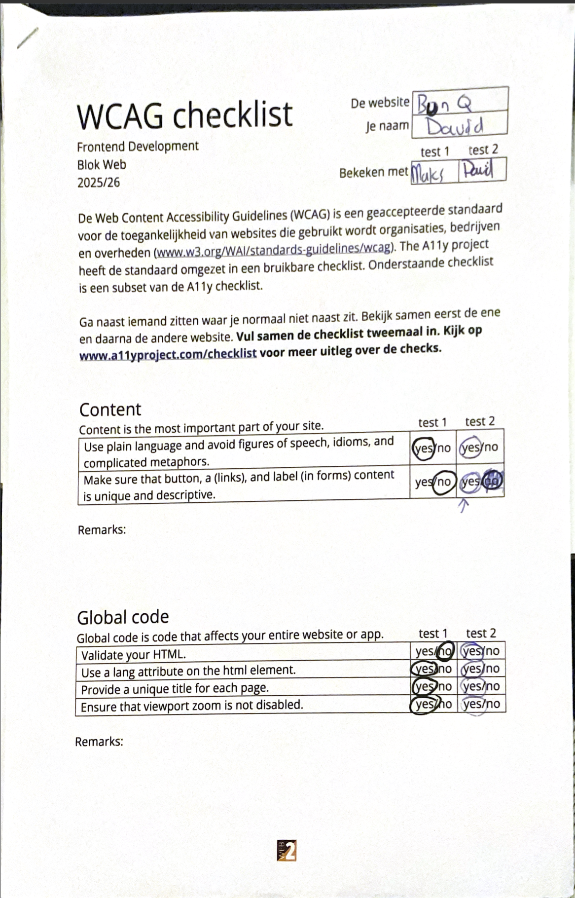
     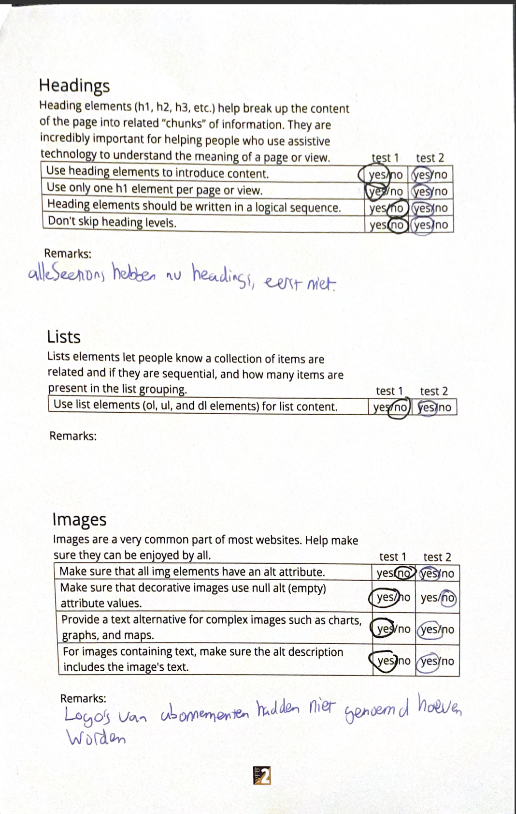
     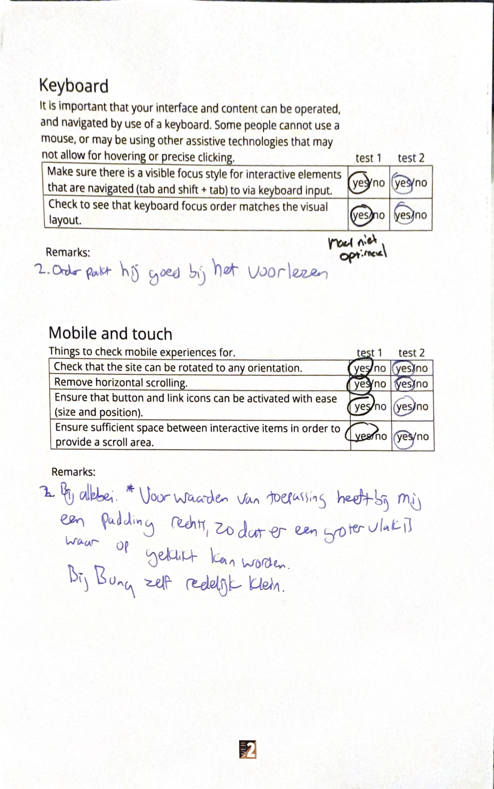
     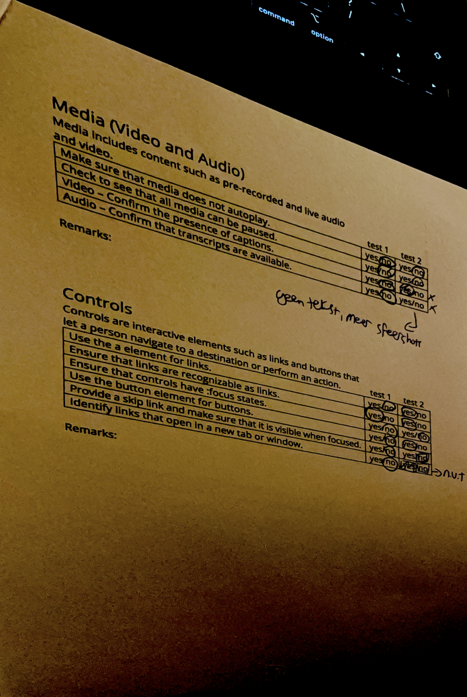
     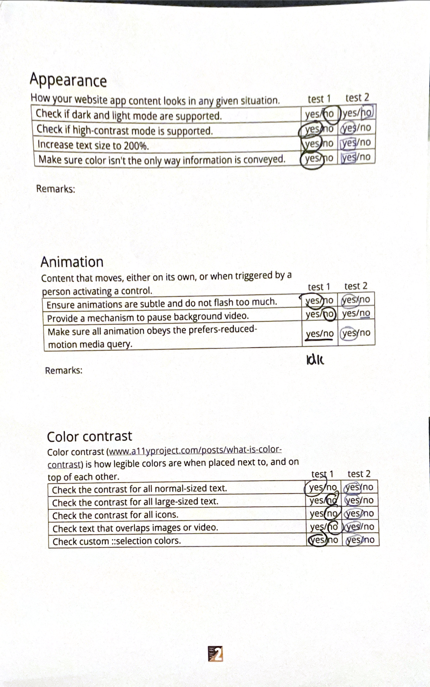

## Voortgang 3 (week 4)

  
uitwerken voor 3e voortgang

  ### Stand van zaken
  hier dit ging goed & dit was lastig (neem ook screenshots op van delen van je website en code)

  ### Agenda voor meeting
  samen met je groepje opstellen

  | student 1      | student 2          | student 3    | student 4        |
  | ---            | ---                | ---          | ---              |
  | dit bespreken  | en dit             | en ik dit    | en dan ik dat    |
  | en dat ook nog | dit als er tijd is | nog een punt | dit wil ik zeker |
  | ...            | ...                | ...          | ...              |

  ### Verslag van meeting
  hier na afloop snel de uitkomsten van de meeting vastleggen

  - punt 1
  - punt 2
  - nog een punt
  - ...

## Eindgesprek (week 5)

  
uitwerken voor eindgesprek

  ### Je uitkomst - karakteristiek screenshots:
 
  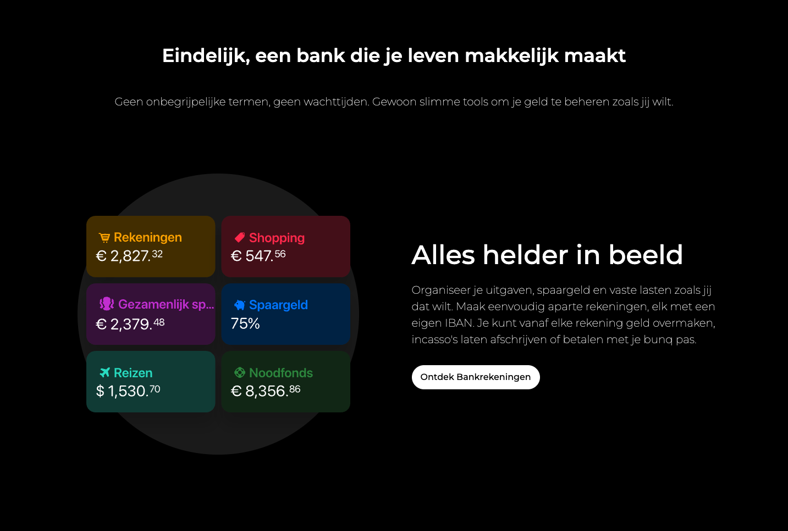
  
  Veel secties, zoals deze, wist ik gemakkelijk responsive te maken. Ik was blij dat dit zo makkelijk ging, aangezien het me maar een paar regels code kostte. Op wat uitzonderingen na. 

Het (responsive) maken van deze cards bij beide sections ging goed! Zo ben ik blij dat ik deze zo 1 op 1 heb kunnen krijgen. 
  

  ### Dit ging goed/Heb ik geleerd: 
  Korte omschrijving met plaatjes
  
  Tijdlijn gedeelte:
  
  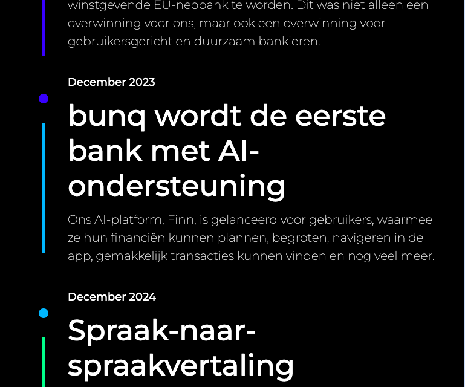
  
  Op het begin van deze website keek ik best wel tegen deze sectie aan. Maar toen ik het voor mobile aan het maken was, ging dit een stuk makkelijker en sneller dan gedacht. Zo was het eigenlijk vooral met div's (sorry) en flex werken voor het linkergedeelte. Door eigenlijk logisch na te denken en hier destijds een breakdownschets van te maken viel het eigenlijk wel mee. 

  

Het (responsive) maken van deze cards bij beide sections ging goed! Zo ben ik blij dat ik deze zo 1 op 1 heb kunnen krijgen. 

  ### Dit was lastig/Is niet gelukt:
  Korte omschrijving met plaatjes
  
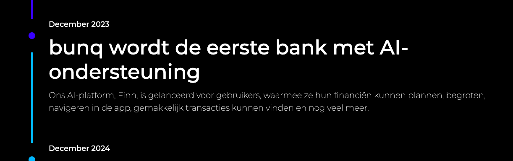 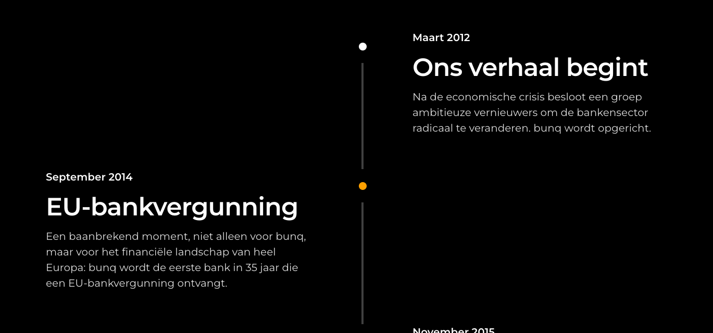

Dit is dezelfde sectie als hierboven. Het is me namelijk niet gelukt om dit door te vertalen naar desktop, ondanks dat ik wel logische oplossingen had. Als ik meer tijd had gehad, had ik hier meer tijd ingestoken, zodat ik helderder kon nadenken. Nu liep ik vast dat als ik een div van 100% breedte zou toevoegen bij een media query van 760px, dit niet lukte. Terwijl het wel op een logische oplossing leek. 

**Hamburgermenu**
Ik heb nu een _fake_ hamburgermenu gemaakt die niet interactief is. Zo probeerde ik https://youtu.be/flItyHiDm7E?si=ijDVlXptdeHR0gfu te implementeren in mijn eigen code, maar liep ik vast. Wel wist ik uit zijn video de basis van de media queries te halen. Zo kon ik wel een menu maken die verdween of verscheen bij een bepaalde grootte. 
  

  

## Bronnenlijst

  
continu bijhouden terwijl je werkt

 In algemeen CSS:
 <ul>
   <li> https://www.perplexity.ai/search/links-is-mijn-code-waarom-bree-JuG2W12.RI2QS0nDbaeRdg → break-word</li>
 <li>https://youtu.be/flItyHiDm7E?si=ijDVlXptdeHR0gfu → header</li>
</ul>
In Home CSS:
<ul>
<li>https://www.w3schools.com/cssref/sel_before.php → before </li>
<li>https://www.w3schools.com/css/css_text_spacing.asp → line-height</li>
<li>https://www.w3schools.com/css/css_text_spacing.asp → letterspacing</li>
<li>https://chatgpt.com/share/696a61c5-1508-800e-80d8-92f4c4fcdcd4 → borderbox</li>
<li>https://www.perplexity.ai/search/hoe-krijg-ik-deze-4-blokken-al-zoE24d7vQFyZaCMIEqf65Q → grid</li>
<li>https://www.perplexity.ai/search/hoe-krijg-ik-meer-info-allemaa-WWw1mX3bSdaHyxAKKSISjw → margin-auto</li>
<li>https://css-tricks.com/using-styling-the-details-element/ → details</li>
</ul>

In Home HTML:
<ul>
  <li>
https://developer.mozilla.org/en-US/docs/Web/HTML/Reference/Elements/marquee → marquee </li>
</ul>
In About Us CSS:
<ul> 
<li>https://www.w3schools.com/cssref/css_pr_aspect-ratio.php → aspect-ratio</li>
<li>https://www.w3schools.com/cssref/css3_pr_object-fit.php → object-fit</li>
<li>(https://www.perplexity.ai/search/hoe-kan-ik-ervoor-zorgen-dat-h-_Xu45PPURDqUCsk26_idGQ → line-clamp)</li>
</ul>

